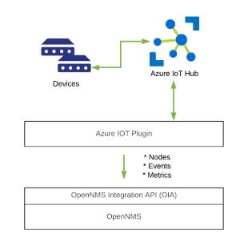

# OpenNMS Azure IOT Plugin

This plugin models devices registed in an Azure IOT Hub to nodes in OpenNMS.



We currently support:
* Building a requisition from all devices in an IOT Hub
* Generating events when a device changes connection states (polled)
* Gathering metrics related to state changes

## Build & install

Build and install the plugin into your local Maven repository using:
```
mvn clean install
```

From the OpenNMS Karaf shell:
```
feature:repo-add mvn:org.opennms.plugins.azure/iot-karaf-features/1.0.0-SNAPSHOT/xml
config:edit org.opennms.plugins.azure.iot
property-set connectionString "HostName=xyz.azure-devices.net;SharedAccessKeyName=iothubowner;SharedAccessKey=xyz"
config:update
feature:install opennms-plugins-azure-iot
```

Update automatically:
```
bundle:watch *
```

# Usage notes

Trigger the import using:
```
opennms-provision:show-import azure-iot
```

## TODO

* Support multiple IOT hubs
* Support for hierarchical topologies
* Can we create links to the device in IOT hub from the node?

